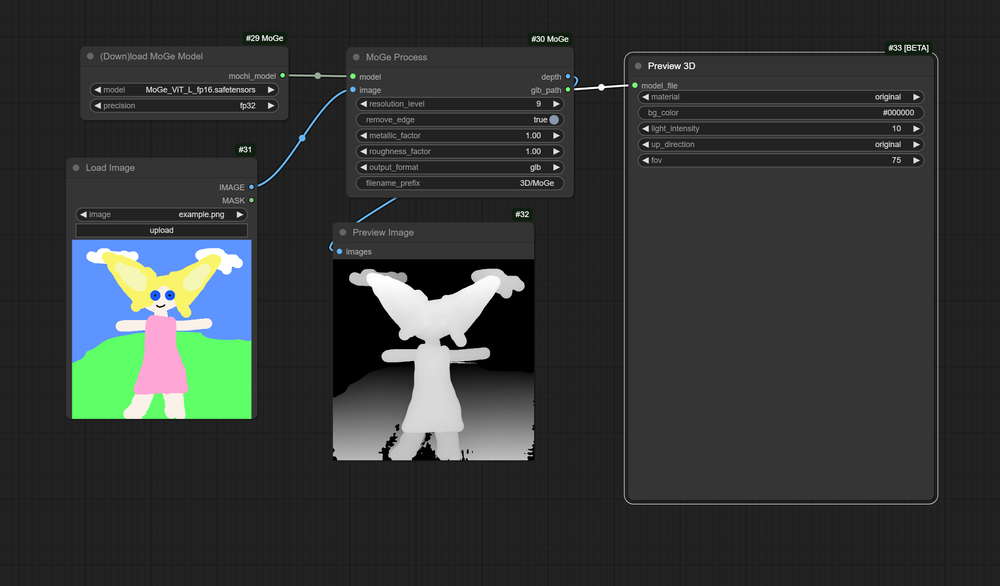

# ComfyUI-MoGe-360: Complete 360° Layered 3D Pipeline

Transform 360° panoramas into layered 3D worlds with automatic object detection, high-quality matting, and spherical mesh generation.

## ✨ Features

### 🌐 Core Spherical MoGe Pipeline
- **360° Tile Sampler (Spherical)**: True spherical projection for equirectangular panoramas
- **MoGe Per-Tile Geometry**: Depth and normal estimation with proper camera intrinsics  
- **360° Depth/Normal Stitcher**: Seamless ERP reconstruction with seam continuity
- **360° Layer Mesher**: Multi-layer spherical mesh generation
- **Spherical Mesh Exporter**: GLB/PLY/OBJ export with proper UV mapping

### 🎯 Layered Processing System
- **OWL-ViT 360° Object Detector**: Open-vocabulary detection with ERP seam handling
- **Detection → ZIM Mattes**: High-quality object mask generation  
- **Sky/Background Splitter**: Automatic layer separation
- **360° Layer Builder**: Multi-layer composition with proper depth ordering
- **Layer Completion**: ERP-safe inpainting to fill occluded regions
- **Alpha Refinement**: Edge smoothing and mask cleanup

## Installation

1. Clone to your ComfyUI custom_nodes folder:
```bash
cd ComfyUI/custom_nodes
git clone https://github.com/cedarconnor/ComfyUI-MoGe-360.git
```

2. Install dependencies:
```bash
pip install -r ComfyUI-MoGe-360/requirements.txt
```

## Model Setup

### Required Models

#### MoGe Models (Auto-downloaded)
Place these in `ComfyUI/models/MoGe/`:
- Models from: https://huggingface.co/Kijai/MoGe_safetensors
- Automatically downloaded when using the "Load MoGe Model" node

#### OWL-ViT Models (For layered processing)
Place these in `ComfyUI/models/owlvit/`:
- Download from: https://huggingface.co/google/owlv2-base-patch16-ensemble
- Required files: `pytorch_model.bin`, `config.json`, `preprocessor_config.json`

#### ZIM Matting Models (For layered processing)
Place these in `ComfyUI/models/zim/`:
- Download: `zim_vit_l_384.onnx` from https://huggingface.co/spaces/naver-ai/ZIM/tree/main
- Model size: ~1.3GB

### Model Directory Structure
```
ComfyUI/
├── models/
│   ├── MoGe/              # Auto-downloaded MoGe models
│   └── transformers_cache/ # Auto-downloaded OWL-ViT and other HF models
```

**Note**: OWL-ViT models are now automatically downloaded from Hugging Face when first used.

## 🚀 Usage

Three complete workflows are provided in the `workflows/` folder:

1. **`quick_360_test.json`** - Fast testing with optimized settings (~5-8 minutes)
2. **`detection_pipeline_test.json`** - Focus on object detection and masking
3. **`complete_360_layered_pipeline.json`** - Full high-quality layered pipeline

### 🎯 Important: OWL-ViT Detection Settings

**Fixed Issue**: OWL-ViT returns very low confidence scores (0.01-0.15) which were causing "no detections" with the previous default threshold of 0.25.

✅ **Solution**: 
- Default confidence threshold is now **0.01** (was 0.25)
- Adjust between **0.001-0.1** for sensitivity control
- Scores above 0.05 are high-confidence detections

### Basic Spherical MoGe Workflow

1. **Load 360° Panorama** → Input equirectangular image (2:1 aspect ratio)
2. **Load MoGe Model** → Choose model and precision (fp16 recommended)
3. **360° Tile Sampler** → Sample perspective tiles with spherical projection
4. **MoGe Per-Tile Geometry** → Process each tile for depth/normals
5. **360° Depth/Normal Stitcher** → Reconstruct full ERP depth map
6. **360° Layer Mesher** → Generate spherical mesh
7. **Spherical Mesh Exporter** → Export to GLB/PLY/OBJ

## ⚙️ Configuration

### Speed vs Quality Settings

**Fast (3-5 minutes)**:
- Tile Grid: 3×2, Tile Size: 512px, MoGe Resolution: 7
- Use `quick_360_test.json` workflow

**High Quality (15-20 minutes)**:
- Tile Grid: 6×3, Tile Size: 768px, MoGe Resolution: 8-9
- Use `complete_360_layered_pipeline.json` workflow

### Detection Parameters
- **confidence_threshold**: 0.001-0.1 (default: 0.01)
- **Text queries**: "mountain peak, rock formation, tree, building, person"
- **ERP mode**: "circular_padding" (handles ±180° seam) or "perspective_tiles" (thorough)
- **NMS threshold**: 0.5 (removes duplicate detections)

## 🛠️ Technical Details

### Spherical Projection System
- True spherical camera model replacing pinhole assumptions  
- Proper equirectangular (2:1) panorama handling
- ERP seam continuity across ±180° longitude boundary
- Pole-aware sampling and stitching

### Memory Requirements
- **Minimum**: 6GB VRAM (3×2 tiles, 512px)
- **Recommended**: 12GB+ VRAM (6×3 tiles, 768px)
- Automatic batching prevents out-of-memory errors

### ERP Seam Handling
- **Circular padding** for detection across longitude seams
- **Weighted blending** in tile overlap regions
- **Mask wrapping** for objects crossing ±180°

## 🎥 Example Results



*360° panorama → Layered 3D mesh with sky, background, and object separation*